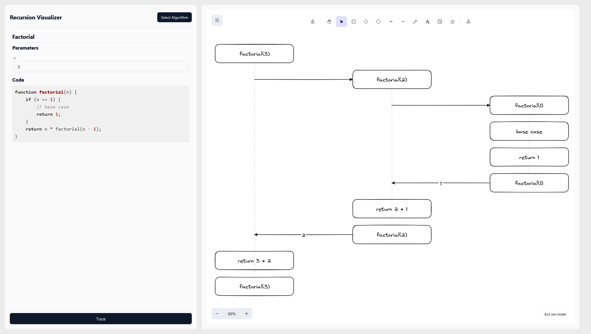

# Recursion Visualizer

A simple web app that draws sequence diagrams for recursive algorithms using Excalidraw.

## 🔧 How it works

The app runs modified versions of recursive algorithms that log a trace of how the functions execute.

The trace consists of the following events :
- Function entry
- Function return
- Output during execution

This trace is then used to build a sequence diagram using [Excalidraw elements](https://docs.excalidraw.com/docs/@excalidraw/excalidraw/api/excalidraw-element-skeleton).

### Available algorithms

- Factorial
- Fibonacci
- Merge Sort

## ⚙️ Running locally

- Clone repository
- `npm install`
- `npm run dev`

## 💻 Built with

- [React](https://react.dev/)
- [Redux Toolkit](https://redux-toolkit.js.org/)
- [shadcn/ui](https://ui.shadcn.com/)
- [Excalidraw](https://github.com/excalidraw/excalidraw)

## 📕 Acknowledgements

This project was inspired by the work of [brpapa](https://github.com/brpapa) on [Recursion Tree Visualizer](https://github.com/brpapa/recursion-tree-visualizer)